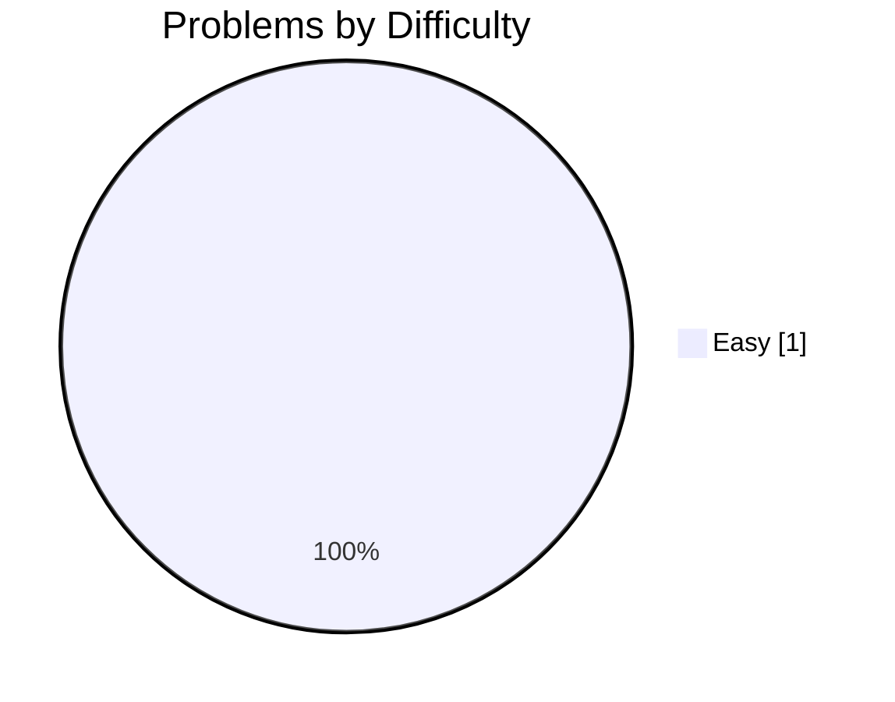
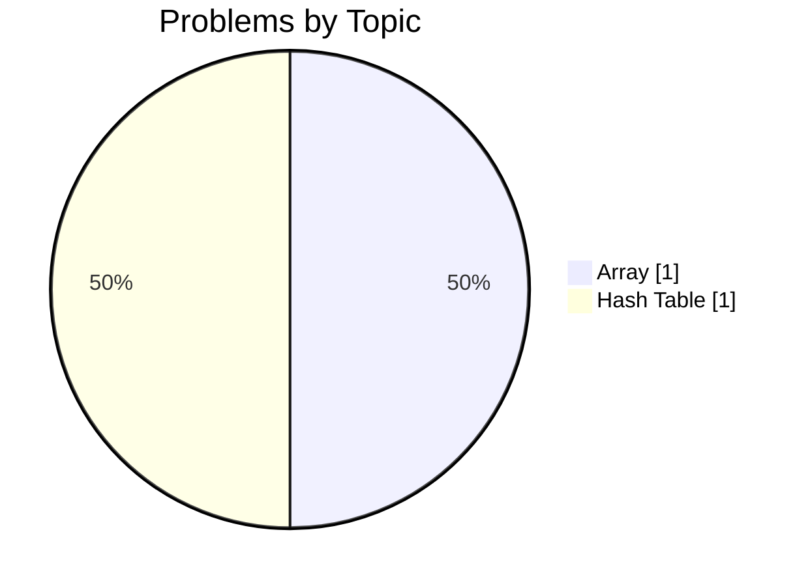
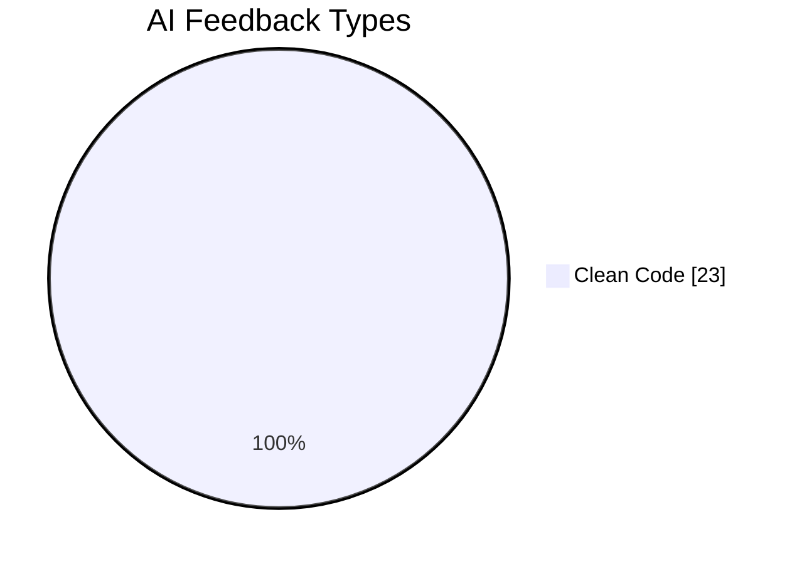
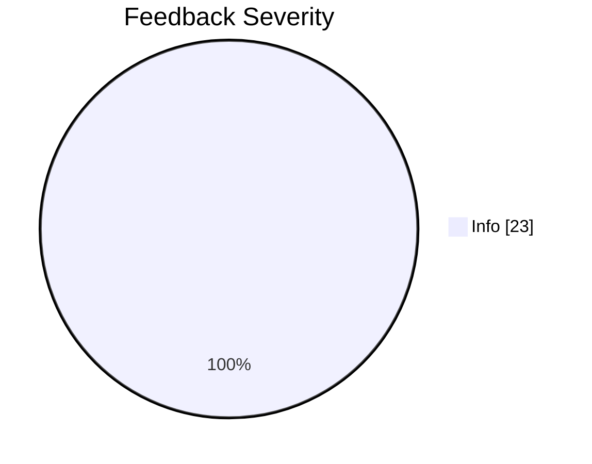
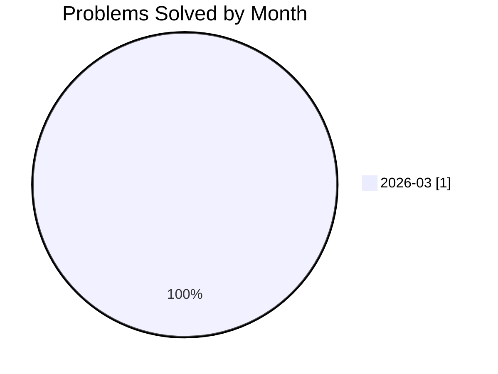

# 🚀 jakubpawinski's Developer Profile

<div align="center">

[](https://github.com/jakubpawinski)
[](https://gitcode.dev/u/jakubpawinski)
[](https://gitcode.dev/u/jakubpawinski)
[](https://gitcode.dev/u/jakubpawinski)

</div>

> **🚀 New Coder on the Rise: First Problem Solved with JavaScript Mastery**

I recently tackled my first coding challenge, solving an easy array problem in JavaScript with a perfect success rate. My code consistently earns clean‑code feedback, and I’m building momentum with daily practice.

---

## 🧠 AI-Powered Insights

<table>
<tr>
<td width="33%" valign="top">

### ✅ Key Strengths
- 100% success rate on attempted problems
- Strong JavaScript proficiency with fast execution times (avg 281.8 ms)
- Clean, well‑structured code recognized by AI reviews
- Persistence demonstrated by 24 submissions to achieve the solution
- Effective problem‑solving on array and hash‑table topics

</td>
<td width="33%" valign="top">

### 💡 Growth Areas
- Expand problem difficulty beyond easy to medium and hard levels
- Broaden topic coverage beyond arrays and hash tables
- Improve consistency score and streak length for sustained practice

</td>
<td width="33%" valign="top">

### 🎯 Recommended Focus
- Target medium‑difficulty challenges in new topics each week
- Set a daily coding goal to raise the consistency score
- Incorporate best‑practice guidelines and performance tuning into JavaScript code

</td>
</tr>
</table>

> *"The journey of a thousand lines of code begins with a single solved problem."*

---

## 📊 Problem Solving Statistics

<table>
<tr>
<td width="50%">

### Overall Performance
| Metric | Value |
|:-------|------:|
| 🧩 Problems Attempted | **1** |
| ✅ Problems Solved | **1** |
| 📝 Total Submissions | **24** |
| 🎯 Success Rate | **100%** |
| ⚡ Avg Execution Time | **281.8 ms** |

</td>
<td width="50%">

### Difficulty Breakdown


</td>
</tr>
</table>

---

## 🔥 Activity & Streaks

### Streak Stats

| 🔥 Current Streak | 🏆 Longest Streak | 📅 Last Activity | ✨ Active Today |
|:-----------------:|:-----------------:|:----------------:|:---------------:|
| **2 days** | **2 days** | **2026-03-10** | **✅ Yes** |

### 📅 Weekly Activity Pattern

| Day | Sun | Mon | Tue | Wed | Thu | Fri | Sat |
|:----|:---:|:---:|:---:|:---:|:---:|:---:|:---:|
| **Submissions** | 0 | 14 | 10 | 0 | 0 | 0 | 0 |
| **Success** | 0 | 14 | 10 | 0 | 0 | 0 | 0 |

```text
Weekly Activity Distribution
Sun │░░░░░░░░░░░░░░░░░░░░░░░░░░░░░░│ 0
Mon │██████████████████████████████│ 14
Tue │█████████████████████░░░░░░░░░│ 10
Wed │░░░░░░░░░░░░░░░░░░░░░░░░░░░░░░│ 0
Thu │░░░░░░░░░░░░░░░░░░░░░░░░░░░░░░│ 0
Fri │░░░░░░░░░░░░░░░░░░░░░░░░░░░░░░│ 0
Sat │░░░░░░░░░░░░░░░░░░░░░░░░░░░░░░│ 0
```

### 📆 Contribution Heatmap (Last 30 Days)

```text
Contribution Activity (2026-03-09 to 2026-03-10)
2026-03-09 │██│ 14 submissions (1 solved)
2026-03-10 │██│ 10 submissions (1 solved)
```

**Legend:** `░░` No activity | `▒▒` 1-2 submissions | `▓▓` 3-5 submissions | `██` 6+ submissions

---

## 💻 Language Proficiency


| Language | Submissions | Success Rate | Avg Time |
|:---------|------------:|-------------:|---------:|
| Javascript | 24 | 100% | 281.8 ms |

---

## 🎯 Topic Mastery



<details>
<summary>📋 Detailed Topic Statistics</summary>

| Topic | Solved | Attempted | Success Rate | Avg Time |
|:------|-------:|----------:|-------------:|---------:|
| Array | 1 | 1 | 100% | 281.8 ms |
| Hash Table | 1 | 1 | 100% | 281.8 ms |

</details>

---

## 🤖 AI Code Review Insights

<table>
<tr>
<td width="50%">

### Feedback by Type


</td>
<td width="50%">

### Feedback by Severity


| Severity | Count | Percentage |
|:---------|------:|-----------:|
| ℹ️ Info | 23 | 100.0% |
| ⚠️ Warning | 0 | 0.0% |
| 🚨 Critical | 0 | 0.0% |

**Total Reviews:** 23

</td>
</tr>
</table>

### 📈 Code Quality Trend

AI reviews show 100% clean‑code suggestions and zero bug, performance, or security issues, indicating your current code is well‑structured. The next step is to incorporate best‑practice recommendations to further strengthen quality.

---

## 📈 Progress Over Time



| Month | Problems Solved | Submissions | Success Rate |
|:------|----------------:|------------:|-------------:|
| 2025-10 | 0 | 0 | 0% |
| 2025-11 | 0 | 0 | 0% |
| 2025-12 | 0 | 0 | 0% |
| 2026-01 | 0 | 0 | 0% |
| 2026-02 | 0 | 0 | 0% |
| 2026-03 | 1 | 24 | 100% |

---

## 🏆 Achievements & Milestones

| Achievement | Description | Progress | Status |
|:------------|:------------|:--------:|:------:|
| **First Blood** 🏆 | Solve your first problem | `1/1` | ✅ Achieved |
| **Getting Started** 🔒 | Solve 10 problems | `1/10` | 🔄 In Progress |
| **Problem Solver** 🔒 | Solve 50 problems | `1/50` | 🔄 In Progress |
| **Century Club** 🔒 | Solve 100 problems | `1/100` | 🔄 In Progress |
| **Hard Mode** 🔒 | Solve 5 hard problems | `0/5` | 🔄 In Progress |
| **Week Warrior** 🔒 | Maintain a 7-day streak | `2/7` | 🔄 In Progress |
| **Monthly Master** 🔒 | Maintain a 30-day streak | `2/30` | 🔄 In Progress |

---

## 📊 Performance Metrics

| ⚡ Avg Execution Time | 🚀 Best Execution Time | 💾 Avg Memory | 🎯 Best Memory |
|:---------------------:|:----------------------:|:-------------:|:--------------:|
| **281.8 ms** | **185 ms** | **N/A MB** | **N/A MB** |

---


## 📉 Computed Metrics

| Metric | Value | Description |
|:-------|:-----:|:------------|
| 🎯 Avg Difficulty Score | **1/3.0** | Average difficulty of solved problems |
| 📈 Consistency Score | **9/100** | Based on activity frequency and streaks |
| 🚀 Growth Rate | **+100%** | Month-over-month improvement |

---

## 💡 Personalized Recommendations

- **Pick a medium‑difficulty problem** each day and try a new topic (e.g., strings, recursion).
- **Maintain a daily coding habit**: aim for at least a 5‑day streak to boost the consistency score.
- **Apply best‑practice patterns**: use linting, modular functions, and performance profiling in your JavaScript solutions.
- **Review AI suggestions** beyond clean‑code tips, focusing on optimization and security as you tackle harder challenges.

---

<div align="center">

### 🌟 Summary

Congratulations on solving your first problem with a flawless success rate and clean code! Your JavaScript skills and persistence are evident, and with a bit more variety and daily consistency, you’re well on your way to becoming a well‑rounded developer.

---

**Generated by [GitCode.dev](https://gitcode.dev)** | Last updated: 2026-03-10 11:34:08 UTC

<sub>
🔥 Current Streak: 2 days |
✅ Problems Solved: 1 |
🎯 Success Rate: 100%
</sub>

</div>