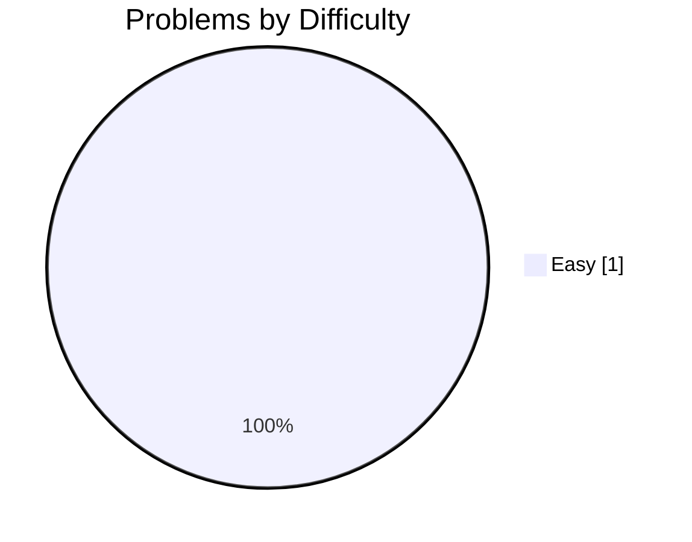
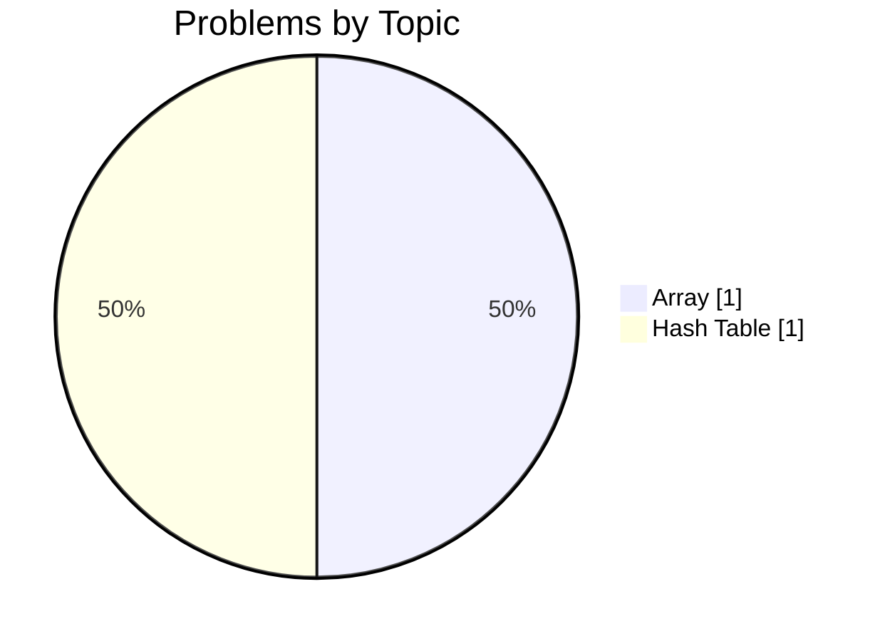
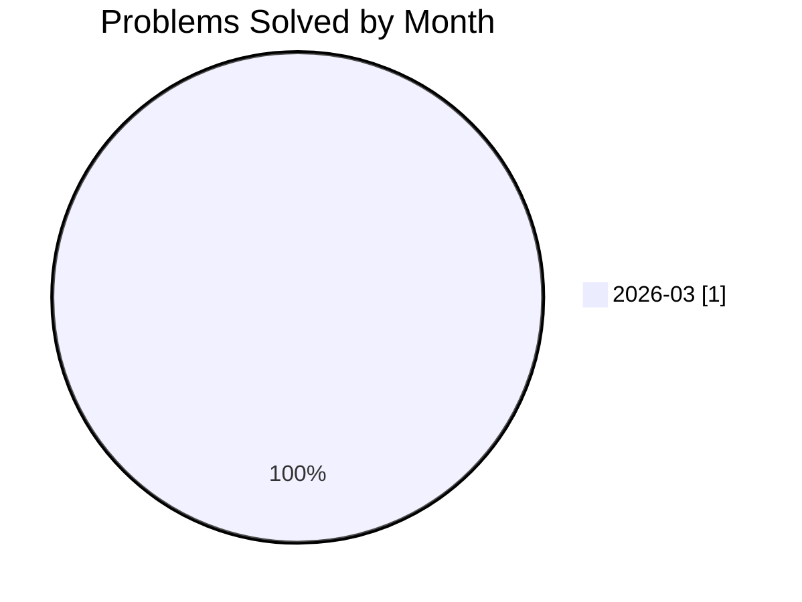

# 🚀 j.pawinski10@gmail.com's Developer Profile

<div align="center">

[](https://github.com/j.pawinski10@gmail.com)
[](https://gitcode.dev/u/j.pawinski10@gmail.com)
[](https://gitcode.dev/u/j.pawinski10@gmail.com)
[](https://gitcode.dev/u/j.pawinski10@gmail.com)

</div>

> **🚀 New Developer on the Rise – First Problem Solved with Clean JavaScript Code**

I just completed my first coding challenge, solving an easy array problem using JavaScript with a 100% success rate. My submissions run in under 300 ms and received only clean‑code suggestions from the AI reviewer. I'm eager to build on this momentum and tackle more complex problems.

---

## 🧠 AI-Powered Insights

<table>
<tr>
<td width="33%" valign="top">

### ✅ Key Strengths
- 100% success rate on attempted problem
- Strong grasp of arrays and hash tables (top‑performing topics)
- Efficient JavaScript implementations (average 277 ms execution)
- Clean coding style recognized by AI code reviews

</td>
<td width="33%" valign="top">

### 💡 Growth Areas
- Limited problem variety – only easy difficulty tackled
- Low consistency score and short streak
- Need to expand into medium and hard difficulty topics

</td>
<td width="33%" valign="top">

### 🎯 Recommended Focus
- Establish a daily coding habit to improve streak and consistency score
- Target medium‑level challenges on arrays and hash tables
- Explore new data structures and algorithm topics to broaden skill set

</td>
</tr>
</table>

> *"The journey of a thousand miles begins with a single solved problem."*

---

## 📊 Problem Solving Statistics

<table>
<tr>
<td width="50%">

### Overall Performance
| Metric | Value |
|:-------|------:|
| 🧩 Problems Attempted | **1** |
| ✅ Problems Solved | **1** |
| 📝 Total Submissions | **8** |
| 🎯 Success Rate | **100%** |
| ⚡ Avg Execution Time | **277.4 ms** |

</td>
<td width="50%">

### Difficulty Breakdown


</td>
</tr>
</table>

---

## 🔥 Activity & Streaks

### Streak Stats

| 🔥 Current Streak | 🏆 Longest Streak | 📅 Last Activity | ✨ Active Today |
|:-----------------:|:-----------------:|:----------------:|:---------------:|
| **1 days** | **1 days** | **2026-03-09** | **✅ Yes** |

### 📅 Weekly Activity Pattern

| Day | Sun | Mon | Tue | Wed | Thu | Fri | Sat |
|:----|:---:|:---:|:---:|:---:|:---:|:---:|:---:|
| **Submissions** | 0 | 8 | 0 | 0 | 0 | 0 | 0 |
| **Success** | 0 | 8 | 0 | 0 | 0 | 0 | 0 |

```text
Weekly Activity Distribution
Sun │░░░░░░░░░░░░░░░░░░░░░░░░░░░░░░│ 0
Mon │██████████████████████████████│ 8
Tue │░░░░░░░░░░░░░░░░░░░░░░░░░░░░░░│ 0
Wed │░░░░░░░░░░░░░░░░░░░░░░░░░░░░░░│ 0
Thu │░░░░░░░░░░░░░░░░░░░░░░░░░░░░░░│ 0
Fri │░░░░░░░░░░░░░░░░░░░░░░░░░░░░░░│ 0
Sat │░░░░░░░░░░░░░░░░░░░░░░░░░░░░░░│ 0
```

### 📆 Contribution Heatmap (Last 30 Days)

```text
Contribution Activity (2026-03-09 to 2026-03-09)
2026-03-09 │██│ 8 submissions (1 solved)
```

**Legend:** `░░` No activity | `▒▒` 1-2 submissions | `▓▓` 3-5 submissions | `██` 6+ submissions

---

## 💻 Language Proficiency


| Language | Submissions | Success Rate | Avg Time |
|:---------|------------:|-------------:|---------:|
| Javascript | 8 | 100% | 277.4 ms |

---

## 🎯 Topic Mastery



<details>
<summary>📋 Detailed Topic Statistics</summary>

| Topic | Solved | Attempted | Success Rate | Avg Time |
|:------|-------:|----------:|-------------:|---------:|
| Array | 1 | 1 | 100% | 277.4 ms |
| Hash Table | 1 | 1 | 100% | 277.4 ms |

</details>

---

## 🤖 AI Code Review Insights

<table>
<tr>
<td width="50%">

### Feedback by Type


</td>
<td width="50%">

### Feedback by Severity


| Severity | Count | Percentage |
|:---------|------:|-----------:|
| ℹ️ Info | 6 | 100.0% |
| ⚠️ Warning | 0 | 0.0% |
| 🚨 Critical | 0 | 0.0% |

**Total Reviews:** 6

</td>
</tr>
</table>

### 📈 Code Quality Trend

AI reviews show zero bugs, performance, or security issues. All six feedback items were clean‑code suggestions, indicating a solid foundation in readable and maintainable code. Continuing to follow best‑practice guidelines will further strengthen code quality.

---

## 📈 Progress Over Time



| Month | Problems Solved | Submissions | Success Rate |
|:------|----------------:|------------:|-------------:|
| 2025-10 | 0 | 0 | 0% |
| 2025-11 | 0 | 0 | 0% |
| 2025-12 | 0 | 0 | 0% |
| 2026-01 | 0 | 0 | 0% |
| 2026-02 | 0 | 0 | 0% |
| 2026-03 | 1 | 8 | 100% |

---

## 🏆 Achievements & Milestones

| Achievement | Description | Progress | Status |
|:------------|:------------|:--------:|:------:|
| **First Blood** 🏆 | Solve your first problem | `1/1` | ✅ Achieved |
| **Getting Started** 🔒 | Solve 10 problems | `1/10` | 🔄 In Progress |
| **Problem Solver** 🔒 | Solve 50 problems | `1/50` | 🔄 In Progress |
| **Century Club** 🔒 | Solve 100 problems | `1/100` | 🔄 In Progress |
| **Hard Mode** 🔒 | Solve 5 hard problems | `0/5` | 🔄 In Progress |
| **Week Warrior** 🔒 | Maintain a 7-day streak | `1/7` | 🔄 In Progress |
| **Monthly Master** 🔒 | Maintain a 30-day streak | `1/30` | 🔄 In Progress |

---

## 📊 Performance Metrics

| ⚡ Avg Execution Time | 🚀 Best Execution Time | 💾 Avg Memory | 🎯 Best Memory |
|:---------------------:|:----------------------:|:-------------:|:--------------:|
| **277.4 ms** | **200 ms** | **N/A MB** | **N/A MB** |

---


## 📉 Computed Metrics

| Metric | Value | Description |
|:-------|:-----:|:------------|
| 🎯 Avg Difficulty Score | **1/3.0** | Average difficulty of solved problems |
| 📈 Consistency Score | **4/100** | Based on activity frequency and streaks |
| 🚀 Growth Rate | **+100%** | Month-over-month improvement |

---

## 💡 Personalized Recommendations

### Next Steps
1. **Set a daily coding goal** – aim for at least one problem per day to grow your streak and boost the consistency score.
2. **Move to medium difficulty** – start with medium‑level array and hash‑table problems to challenge your logic.
3. **Diversify topics** – add linked lists, strings, and recursion to your practice roster.
4. **Track performance metrics** – keep an eye on execution time and memory as problems get harder.
5. **Leverage AI feedback** – incorporate the clean‑code suggestions into every new submission to cement good habits.

---

<div align="center">

### 🌟 Summary

Congratulations on earning your first "First Blood" milestone! You've demonstrated a clean coding style and swift JavaScript execution while achieving a perfect success rate. With a focused daily practice and gradual increase in difficulty, you'll quickly turn this strong start into a robust portfolio of solved challenges.

---

**Generated by [GitCode.dev](https://gitcode.dev)** | Last updated: 2026-03-09 19:07:42 UTC

<sub>
🔥 Current Streak: 1 days |
✅ Problems Solved: 1 |
🎯 Success Rate: 100%
</sub>

</div>