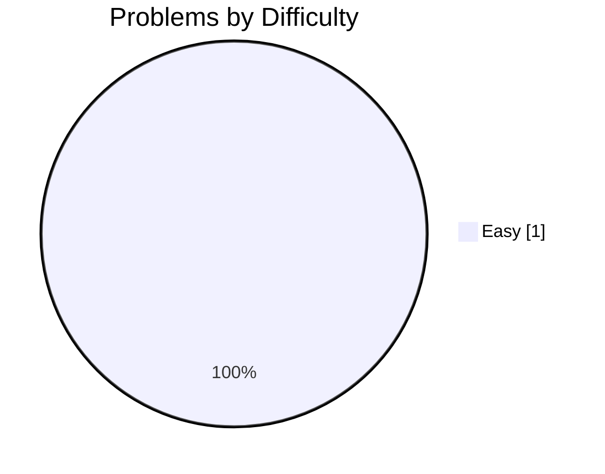
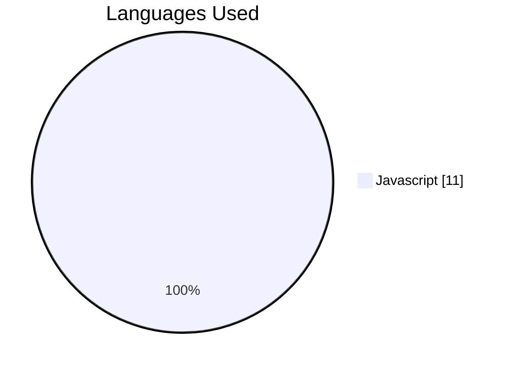
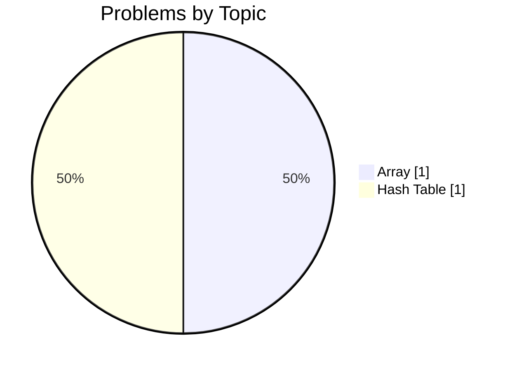
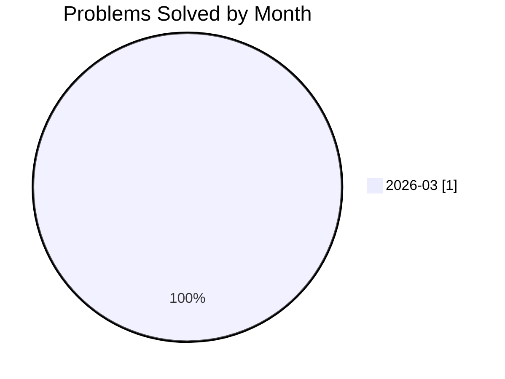

# 🚀 j.pawinski10@gmail.com's Developer Profile

<div align="center">

[](https://github.com/j.pawinski10@gmail.com)
[](https://gitcode.dev/u/j.pawinski10@gmail.com)
[](https://gitcode.dev/u/j.pawinski10@gmail.com)
[](https://gitcode.dev/u/j.pawinski10@gmail.com)

</div>

> **🚀 New JavaScript Solver with 100% Success on First Challenge**

I’ve just solved my first LeetCode problem using JavaScript, achieving a perfect 100% success rate. My solution showcases clean code and efficient execution (average 271 ms). I’m eager to expand my skill set across more topics and difficulty levels.

---

## 🧠 AI-Powered Insights

<table>
<tr>
<td width="33%" valign="top">

### ✅ Key Strengths
- 100% success rate on the problem attempted
- Strong understanding of array and hash‑table concepts
- Clean, well‑structured code highlighted by AI reviews
- Efficient JavaScript implementation with sub‑300 ms runtime
- Consistent daily activity (active today)

</td>
<td width="33%" valign="top">

### 💡 Growth Areas
- Limited exposure to medium and hard difficulty problems
- Narrow topic coverage – need to practice additional data structures and algorithms
- Low consistency score and short streak indicate habit‑building opportunities

</td>
<td width="33%" valign="top">

### 🎯 Recommended Focus
- Tackle medium‑level problems to broaden difficulty experience
- Explore new topics such as sorting, recursion, and graph algorithms
- Establish a daily coding routine to improve consistency and streak length

</td>
</tr>
</table>

> *"Every expert was once a beginner; keep coding, the journey has just begun."*

---

## 📊 Problem Solving Statistics

<table>
<tr>
<td width="50%">

### Overall Performance
| Metric | Value |
|:-------|------:|
| 🧩 Problems Attempted | **1** |
| ✅ Problems Solved | **1** |
| 📝 Total Submissions | **11** |
| 🎯 Success Rate | **100%** |
| ⚡ Avg Execution Time | **271.3 ms** |

</td>
<td width="50%">

### Difficulty Breakdown


</td>
</tr>
</table>

---

## 🔥 Activity & Streaks

### Streak Stats

| 🔥 Current Streak | 🏆 Longest Streak | 📅 Last Activity | ✨ Active Today |
|:-----------------:|:-----------------:|:----------------:|:---------------:|
| **1 days** | **1 days** | **2026-03-09** | **✅ Yes** |

### 📅 Weekly Activity Pattern

| Day | Sun | Mon | Tue | Wed | Thu | Fri | Sat |
|:----|:---:|:---:|:---:|:---:|:---:|:---:|:---:|
| **Submissions** | 0 | 11 | 0 | 0 | 0 | 0 | 0 |
| **Success** | 0 | 11 | 0 | 0 | 0 | 0 | 0 |

```text
Weekly Activity Distribution
Sun │░░░░░░░░░░░░░░░░░░░░░░░░░░░░░░│ 0
Mon │██████████████████████████████│ 11
Tue │░░░░░░░░░░░░░░░░░░░░░░░░░░░░░░│ 0
Wed │░░░░░░░░░░░░░░░░░░░░░░░░░░░░░░│ 0
Thu │░░░░░░░░░░░░░░░░░░░░░░░░░░░░░░│ 0
Fri │░░░░░░░░░░░░░░░░░░░░░░░░░░░░░░│ 0
Sat │░░░░░░░░░░░░░░░░░░░░░░░░░░░░░░│ 0
```

### 📆 Contribution Heatmap (Last 30 Days)

```text
Contribution Activity (2026-03-09 to 2026-03-09)
2026-03-09 │██│ 11 submissions (1 solved)
```

**Legend:** `░░` No activity | `▒▒` 1-2 submissions | `▓▓` 3-5 submissions | `██` 6+ submissions

---

## 💻 Language Proficiency



| Language | Submissions | Success Rate | Avg Time |
|:---------|------------:|-------------:|---------:|
| Javascript | 11 | 100% | 271.3 ms |

---

## 🎯 Topic Mastery



<details>
<summary>📋 Detailed Topic Statistics</summary>

| Topic | Solved | Attempted | Success Rate | Avg Time |
|:------|-------:|----------:|-------------:|---------:|
| Array | 1 | 1 | 100% | 271.3 ms |
| Hash Table | 1 | 1 | 100% | 271.3 ms |

</details>

---

## 🤖 AI Code Review Insights

<table>
<tr>
<td width="50%">

### Feedback by Type


</td>
<td width="50%">

### Feedback by Severity


| Severity | Count | Percentage |
|:---------|------:|-----------:|
| ℹ️ Info | 9 | 100.0% |
| ⚠️ Warning | 0 | 0.0% |
| 🚨 Critical | 0 | 0.0% |

**Total Reviews:** 9

</td>
</tr>
</table>

### 📈 Code Quality Trend

AI code reviews reported 100% clean‑code suggestions with no bugs, performance, or security issues. This indicates your current code is well‑structured and readable, though you have an opportunity to incorporate deeper best‑practice guidance and optimization techniques as you take on more complex problems.

---

## 📈 Progress Over Time



| Month | Problems Solved | Submissions | Success Rate |
|:------|----------------:|------------:|-------------:|
| 2025-10 | 0 | 0 | 0% |
| 2025-11 | 0 | 0 | 0% |
| 2025-12 | 0 | 0 | 0% |
| 2026-01 | 0 | 0 | 0% |
| 2026-02 | 0 | 0 | 0% |
| 2026-03 | 1 | 11 | 100% |

---

## 🏆 Achievements & Milestones

| Achievement | Description | Progress | Status |
|:------------|:------------|:--------:|:------:|
| **First Blood** 🏆 | Solve your first problem | `1/1` | ✅ Achieved |
| **Getting Started** 🔒 | Solve 10 problems | `1/10` | 🔄 In Progress |
| **Problem Solver** 🔒 | Solve 50 problems | `1/50` | 🔄 In Progress |
| **Century Club** 🔒 | Solve 100 problems | `1/100` | 🔄 In Progress |
| **Hard Mode** 🔒 | Solve 5 hard problems | `0/5` | 🔄 In Progress |
| **Week Warrior** 🔒 | Maintain a 7-day streak | `1/7` | 🔄 In Progress |
| **Monthly Master** 🔒 | Maintain a 30-day streak | `1/30` | 🔄 In Progress |

---

## 📊 Performance Metrics

| ⚡ Avg Execution Time | 🚀 Best Execution Time | 💾 Avg Memory | 🎯 Best Memory |
|:---------------------:|:----------------------:|:-------------:|:--------------:|
| **271.3 ms** | **185 ms** | **N/A MB** | **N/A MB** |

---


## 📉 Computed Metrics

| Metric | Value | Description |
|:-------|:-----:|:------------|
| 🎯 Avg Difficulty Score | **1/3.0** | Average difficulty of solved problems |
| 📈 Consistency Score | **4/100** | Based on activity frequency and streaks |
| 🚀 Growth Rate | **+100%** | Month-over-month improvement |

---

## 💡 Personalized Recommendations

### Next Steps
- **Pick a medium‑difficulty problem each day** – start with topics like two‑pointer arrays or basic recursion.
- **Add new topic tags** – try sorting, linked lists, or binary trees to broaden your algorithmic toolkit.
- **Commit to a 7‑day streak** – set a reminder to solve at least one problem daily; even a quick attempt counts toward consistency.
- **Review AI clean‑code suggestions** – incorporate any style tips to further polish your code.
- **Track execution metrics** – aim to keep runtimes under 250 ms as problems become more complex.

---

<div align="center">

### 🌟 Summary

Congratulations on earning your "First Blood" milestone with a flawless 100% success rate! Your clean JavaScript solutions and solid grasp of arrays and hash tables set a strong foundation. By expanding into medium challenges and diversifying topics, you’ll turn this promising start into sustained growth. Keep the momentum going—you’re on the right path!

---

**Generated by [GitCode.dev](https://gitcode.dev)** | Last updated: 2026-03-09 19:12:39 UTC

<sub>
🔥 Current Streak: 1 days |
✅ Problems Solved: 1 |
🎯 Success Rate: 100%
</sub>

</div>