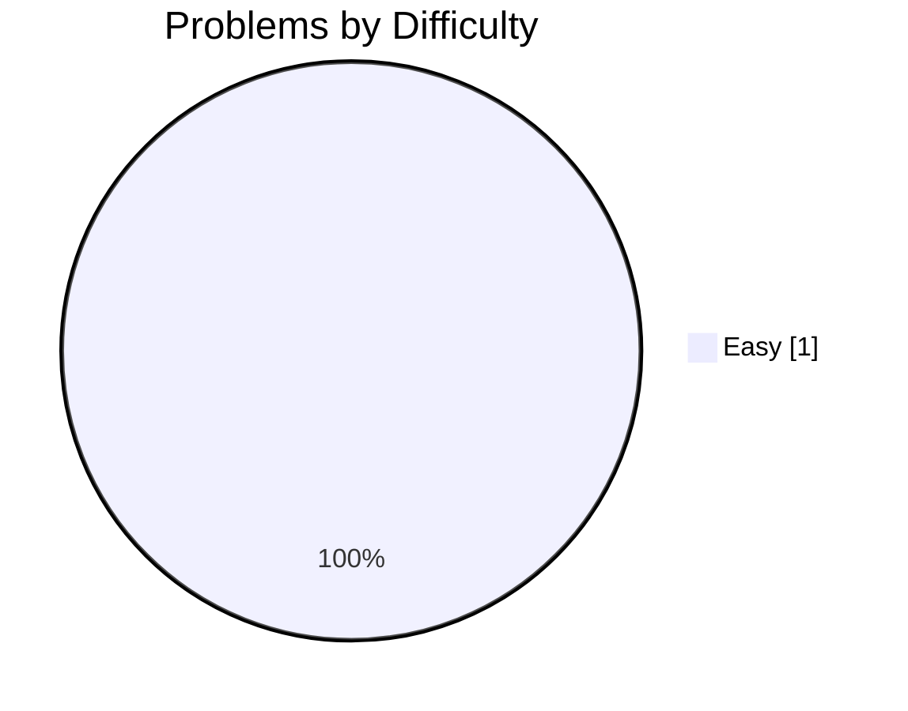
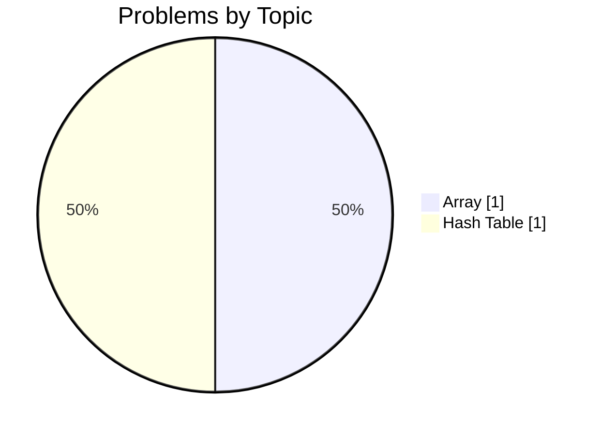
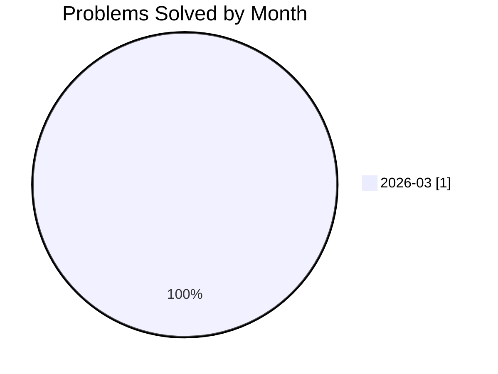

# 🚀 j.pawinski10@gmail.com's Developer Profile

<div align="center">

[](https://github.com/j.pawinski10@gmail.com)
[](https://gitcode.dev/u/j.pawinski10@gmail.com)
[](https://gitcode.dev/u/j.pawinski10@gmail.com)
[](https://gitcode.dev/u/j.pawinski10@gmail.com)

</div>

> **🚀 First Blood Achieved: JavaScript Enthusiast Tackling Arrays & Hash Tables**

I just cracked my first coding challenge, solving an easy array problem in JavaScript with a 100% success rate. My submissions are clean and performant, and I’m eager to build on this momentum.

---

## 🧠 AI-Powered Insights

<table>
<tr>
<td width="33%" valign="top">

### ✅ Key Strengths
- Strong grasp of array manipulation
- Effective use of hash tables
- Clean and readable JavaScript code
- Rapid problem‑solving on easy‑level challenges

</td>
<td width="33%" valign="top">

### 💡 Growth Areas
- Expand to medium and hard difficulty problems
- Broaden topic coverage beyond arrays and hash tables
- Increase daily coding consistency

</td>
<td width="33%" valign="top">

### 🎯 Recommended Focus
- Target 1–2 medium‑difficulty challenges each week
- Add new topics such as strings, recursion, and linked lists
- Maintain a daily streak to boost consistency score

</td>
</tr>
</table>

> *"The journey of a thousand lines of code begins with a single solved problem."*

---

## 📊 Problem Solving Statistics

<table>
<tr>
<td width="50%">

### Overall Performance
| Metric | Value |
|:-------|------:|
| 🧩 Problems Attempted | **1** |
| ✅ Problems Solved | **1** |
| 📝 Total Submissions | **9** |
| 🎯 Success Rate | **100%** |
| ⚡ Avg Execution Time | **274.3 ms** |

</td>
<td width="50%">

### Difficulty Breakdown


</td>
</tr>
</table>

---

## 🔥 Activity & Streaks

### Streak Stats

| 🔥 Current Streak | 🏆 Longest Streak | 📅 Last Activity | ✨ Active Today |
|:-----------------:|:-----------------:|:----------------:|:---------------:|
| **1 days** | **1 days** | **2026-03-09** | **✅ Yes** |

### 📅 Weekly Activity Pattern

| Day | Sun | Mon | Tue | Wed | Thu | Fri | Sat |
|:----|:---:|:---:|:---:|:---:|:---:|:---:|:---:|
| **Submissions** | 0 | 9 | 0 | 0 | 0 | 0 | 0 |
| **Success** | 0 | 9 | 0 | 0 | 0 | 0 | 0 |

```text
Weekly Activity Distribution
Sun │░░░░░░░░░░░░░░░░░░░░░░░░░░░░░░│ 0
Mon │██████████████████████████████│ 9
Tue │░░░░░░░░░░░░░░░░░░░░░░░░░░░░░░│ 0
Wed │░░░░░░░░░░░░░░░░░░░░░░░░░░░░░░│ 0
Thu │░░░░░░░░░░░░░░░░░░░░░░░░░░░░░░│ 0
Fri │░░░░░░░░░░░░░░░░░░░░░░░░░░░░░░│ 0
Sat │░░░░░░░░░░░░░░░░░░░░░░░░░░░░░░│ 0
```

### 📆 Contribution Heatmap (Last 30 Days)

```text
Contribution Activity (2026-03-09 to 2026-03-09)
2026-03-09 │██│ 9 submissions (1 solved)
```

**Legend:** `░░` No activity | `▒▒` 1-2 submissions | `▓▓` 3-5 submissions | `██` 6+ submissions

---

## 💻 Language Proficiency


| Language | Submissions | Success Rate | Avg Time |
|:---------|------------:|-------------:|---------:|
| Javascript | 9 | 100% | 274.3 ms |

---

## 🎯 Topic Mastery



<details>
<summary>📋 Detailed Topic Statistics</summary>

| Topic | Solved | Attempted | Success Rate | Avg Time |
|:------|-------:|----------:|-------------:|---------:|
| Array | 1 | 1 | 100% | 274.3 ms |
| Hash Table | 1 | 1 | 100% | 274.3 ms |

</details>

---

## 🤖 AI Code Review Insights

<table>
<tr>
<td width="50%">

### Feedback by Type


</td>
<td width="50%">

### Feedback by Severity


| Severity | Count | Percentage |
|:---------|------:|-----------:|
| ℹ️ Info | 8 | 100.0% |
| ⚠️ Warning | 0 | 0.0% |
| 🚨 Critical | 0 | 0.0% |

**Total Reviews:** 8

</td>
</tr>
</table>

### 📈 Code Quality Trend

AI reviews show zero bugs, performance, or security issues; all feedback was clean‑code suggestions, confirming good coding habits but indicating room for deeper best‑practice guidance.

---

## 📈 Progress Over Time



| Month | Problems Solved | Submissions | Success Rate |
|:------|----------------:|------------:|-------------:|
| 2025-10 | 0 | 0 | 0% |
| 2025-11 | 0 | 0 | 0% |
| 2025-12 | 0 | 0 | 0% |
| 2026-01 | 0 | 0 | 0% |
| 2026-02 | 0 | 0 | 0% |
| 2026-03 | 1 | 9 | 100% |

---

## 🏆 Achievements & Milestones

| Achievement | Description | Progress | Status |
|:------------|:------------|:--------:|:------:|
| **First Blood** 🏆 | Solve your first problem | `1/1` | ✅ Achieved |
| **Getting Started** 🔒 | Solve 10 problems | `1/10` | 🔄 In Progress |
| **Problem Solver** 🔒 | Solve 50 problems | `1/50` | 🔄 In Progress |
| **Century Club** 🔒 | Solve 100 problems | `1/100` | 🔄 In Progress |
| **Hard Mode** 🔒 | Solve 5 hard problems | `0/5` | 🔄 In Progress |
| **Week Warrior** 🔒 | Maintain a 7-day streak | `1/7` | 🔄 In Progress |
| **Monthly Master** 🔒 | Maintain a 30-day streak | `1/30` | 🔄 In Progress |

---

## 📊 Performance Metrics

| ⚡ Avg Execution Time | 🚀 Best Execution Time | 💾 Avg Memory | 🎯 Best Memory |
|:---------------------:|:----------------------:|:-------------:|:--------------:|
| **274.3 ms** | **200 ms** | **N/A MB** | **N/A MB** |

---


## 📉 Computed Metrics

| Metric | Value | Description |
|:-------|:-----:|:------------|
| 🎯 Avg Difficulty Score | **1/3.0** | Average difficulty of solved problems |
| 📈 Consistency Score | **4/100** | Based on activity frequency and streaks |
| 🚀 Growth Rate | **+100%** | Month-over-month improvement |

---

## 💡 Personalized Recommendations

### Next Steps
- **Pick a medium‑difficulty problem** each week to stretch your algorithmic thinking.
- **Explore new topics** (e.g., strings, recursion, linked lists) to diversify your skill set.
- **Set a daily coding goal** (even a small one) to improve your consistency score and streak.
- **Review clean‑code suggestions** and incorporate any best‑practice tips for even more robust code.
- **Track execution time** and aim to lower the average below 250 ms as you tackle harder challenges.

---

<div align="center">

### 🌟 Summary

Congratulations on earning your first ‘First Blood’ milestone with a flawless 100% success rate! Your clean JavaScript implementations and strong foundation in arrays and hash tables set a solid base for future growth. Keep the momentum going, expand your problem repertoire, and watch your coding journey soar.

---

**Generated by [GitCode.dev](https://gitcode.dev)** | Last updated: 2026-03-09 19:08:30 UTC

<sub>
🔥 Current Streak: 1 days |
✅ Problems Solved: 1 |
🎯 Success Rate: 100%
</sub>

</div>