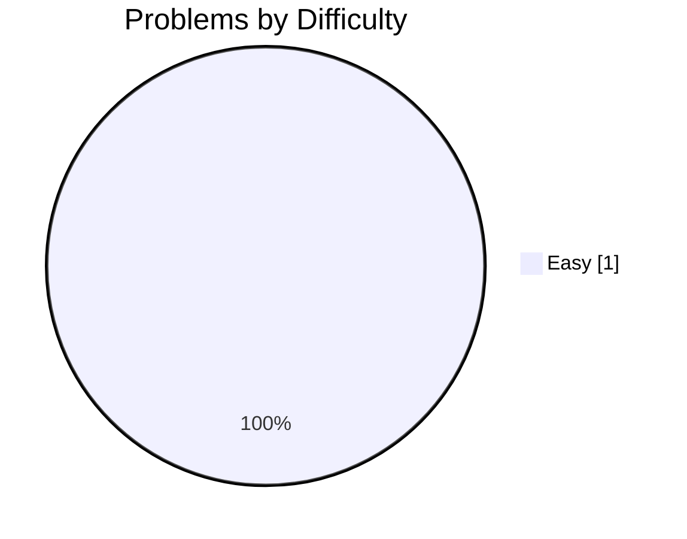
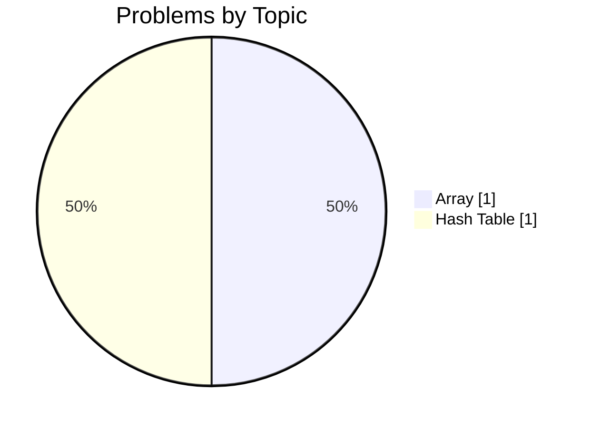
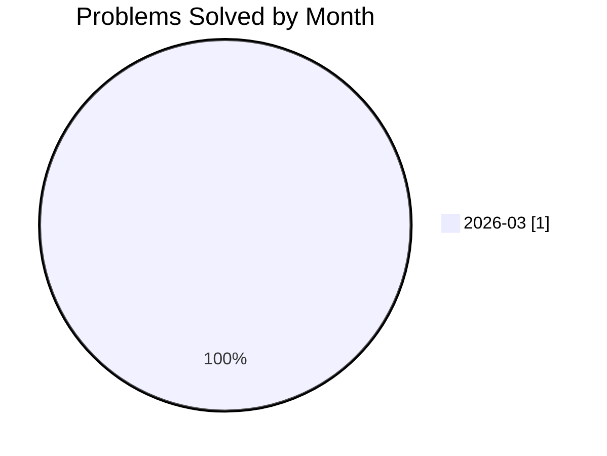

# 🚀 j.pawinski10@gmail.com's Developer Profile

<div align="center">

[](https://github.com/j.pawinski10@gmail.com)
[](https://gitcode.dev/u/j.pawinski10@gmail.com)
[](https://gitcode.dev/u/j.pawinski10@gmail.com)
[](https://gitcode.dev/u/j.pawinski10@gmail.com)

</div>

> **🚀 First Problem Solved – Building a Strong JavaScript Foundation**

I recently nailed my first coding challenge, achieving a 100% success rate with clean JavaScript solutions. My code runs fast (average 295 ms) and follows good style, earning only clean‑code suggestions from AI reviews. I'm eager to broaden my skill set and keep the momentum going.

---

## 🧠 AI-Powered Insights

<table>
<tr>
<td width="33%" valign="top">

### ✅ Key Strengths
- 100% success rate on the first problem (1/1 solved)
- Solid grasp of arrays and hash tables
- Clean, well‑structured JavaScript code (no bugs or performance issues)
- Fast execution time with an average of 295 ms

</td>
<td width="33%" valign="top">

### 💡 Growth Areas
- Expand problem difficulty to medium and hard levels
- Diversify topic coverage beyond arrays and hash tables
- Improve daily coding streak and overall consistency score

</td>
<td width="33%" valign="top">

### 🎯 Recommended Focus
- Solve at least one medium‑difficulty problem each week
- Explore additional data‑structure topics such as linked lists, trees, and graphs
- Establish a regular coding schedule (e.g., 30 min daily) to boost streaks

</td>
</tr>
</table>

> *"The journey of a thousand lines starts with a single solved problem."*

---

## 📊 Problem Solving Statistics

<table>
<tr>
<td width="50%">

### Overall Performance
| Metric | Value |
|:-------|------:|
| 🧩 Problems Attempted | **1** |
| ✅ Problems Solved | **1** |
| 📝 Total Submissions | **6** |
| 🎯 Success Rate | **100%** |
| ⚡ Avg Execution Time | **295 ms** |

</td>
<td width="50%">

### Difficulty Breakdown


</td>
</tr>
</table>

---

## 🔥 Activity & Streaks

### Streak Stats

| 🔥 Current Streak | 🏆 Longest Streak | 📅 Last Activity | ✨ Active Today |
|:-----------------:|:-----------------:|:----------------:|:---------------:|
| **1 days** | **1 days** | **2026-03-09** | **✅ Yes** |

### 📅 Weekly Activity Pattern

| Day | Sun | Mon | Tue | Wed | Thu | Fri | Sat |
|:----|:---:|:---:|:---:|:---:|:---:|:---:|:---:|
| **Submissions** | 0 | 6 | 0 | 0 | 0 | 0 | 0 |
| **Success** | 0 | 6 | 0 | 0 | 0 | 0 | 0 |

```text
Weekly Activity Distribution
Sun │░░░░░░░░░░░░░░░░░░░░░░░░░░░░░░│ 0
Mon │██████████████████████████████│ 6
Tue │░░░░░░░░░░░░░░░░░░░░░░░░░░░░░░│ 0
Wed │░░░░░░░░░░░░░░░░░░░░░░░░░░░░░░│ 0
Thu │░░░░░░░░░░░░░░░░░░░░░░░░░░░░░░│ 0
Fri │░░░░░░░░░░░░░░░░░░░░░░░░░░░░░░│ 0
Sat │░░░░░░░░░░░░░░░░░░░░░░░░░░░░░░│ 0
```

### 📆 Contribution Heatmap (Last 30 Days)

```text
Contribution Activity (2026-03-09 to 2026-03-09)
2026-03-09 │██│ 6 submissions (1 solved)
```

**Legend:** `░░` No activity | `▒▒` 1-2 submissions | `▓▓` 3-5 submissions | `██` 6+ submissions

---

## 💻 Language Proficiency


| Language | Submissions | Success Rate | Avg Time |
|:---------|------------:|-------------:|---------:|
| Javascript | 6 | 100% | 295 ms |

---

## 🎯 Topic Mastery



<details>
<summary>📋 Detailed Topic Statistics</summary>

| Topic | Solved | Attempted | Success Rate | Avg Time |
|:------|-------:|----------:|-------------:|---------:|
| Array | 1 | 1 | 100% | 295 ms |
| Hash Table | 1 | 1 | 100% | 295 ms |

</details>

---

## 🤖 AI Code Review Insights

<table>
<tr>
<td width="50%">

### Feedback by Type


</td>
<td width="50%">

### Feedback by Severity


| Severity | Count | Percentage |
|:---------|------:|-----------:|
| ℹ️ Info | 5 | 100.0% |
| ⚠️ Warning | 0 | 0.0% |
| 🚨 Critical | 0 | 0.0% |

**Total Reviews:** 5

</td>
</tr>
</table>

### 📈 Code Quality Trend

AI reviews show 100% clean‑code suggestions and zero bugs, performance, or security issues, confirming solid fundamentals. The next step is to incorporate advanced best‑practice patterns and refactoring techniques as problem complexity grows.

---

## 📈 Progress Over Time



| Month | Problems Solved | Submissions | Success Rate |
|:------|----------------:|------------:|-------------:|
| 2025-10 | 0 | 0 | 0% |
| 2025-11 | 0 | 0 | 0% |
| 2025-12 | 0 | 0 | 0% |
| 2026-01 | 0 | 0 | 0% |
| 2026-02 | 0 | 0 | 0% |
| 2026-03 | 1 | 6 | 100% |

---

## 🏆 Achievements & Milestones

| Achievement | Description | Progress | Status |
|:------------|:------------|:--------:|:------:|
| **First Blood** 🏆 | Solve your first problem | `1/1` | ✅ Achieved |
| **Getting Started** 🔒 | Solve 10 problems | `1/10` | 🔄 In Progress |
| **Problem Solver** 🔒 | Solve 50 problems | `1/50` | 🔄 In Progress |
| **Century Club** 🔒 | Solve 100 problems | `1/100` | 🔄 In Progress |
| **Hard Mode** 🔒 | Solve 5 hard problems | `0/5` | 🔄 In Progress |
| **Week Warrior** 🔒 | Maintain a 7-day streak | `1/7` | 🔄 In Progress |
| **Monthly Master** 🔒 | Maintain a 30-day streak | `1/30` | 🔄 In Progress |

---

## 📊 Performance Metrics

| ⚡ Avg Execution Time | 🚀 Best Execution Time | 💾 Avg Memory | 🎯 Best Memory |
|:---------------------:|:----------------------:|:-------------:|:--------------:|
| **295 ms** | **217 ms** | **N/A MB** | **N/A MB** |

---


## 📉 Computed Metrics

| Metric | Value | Description |
|:-------|:-----:|:------------|
| 🎯 Avg Difficulty Score | **1/3.0** | Average difficulty of solved problems |
| 📈 Consistency Score | **4/100** | Based on activity frequency and streaks |
| 🚀 Growth Rate | **+100%** | Month-over-month improvement |

---

## 💡 Personalized Recommendations

### Next Steps
- **Target medium difficulty**: Pick a problem from the "Medium" tier each week to stretch your algorithmic thinking.
- **Broaden data‑structure knowledge**: Add linked lists, stacks, queues, and trees to your study list.
- **Build a habit**: Commit to a short daily coding session (15‑30 min) and track streaks on your dashboard.
- **Deepen JavaScript expertise**: Explore ES2022 features, async patterns, and module organization to keep your codebase clean as it grows.
- **Review best practices**: After each solution, revisit the AI clean‑code suggestions and try to apply an additional best‑practice tip (e.g., immutability, descriptive naming).

---

<div align="center">

### 🌟 Summary

Congratulations on your first solved problem and spotless code! With a strong start in JavaScript and data structures, you're well positioned to tackle more challenging problems and turn daily practice into lasting progress.

---

**Generated by [GitCode.dev](https://gitcode.dev)** | Last updated: 2026-03-09 19:07:28 UTC

<sub>
🔥 Current Streak: 1 days |
✅ Problems Solved: 1 |
🎯 Success Rate: 100%
</sub>

</div>