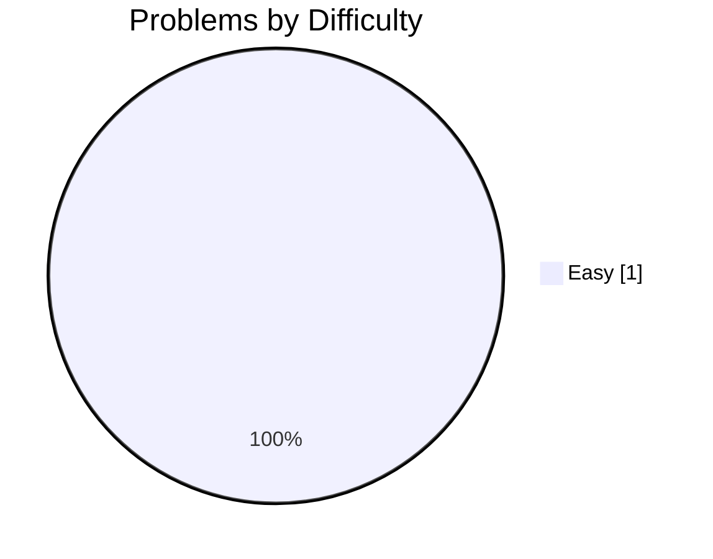
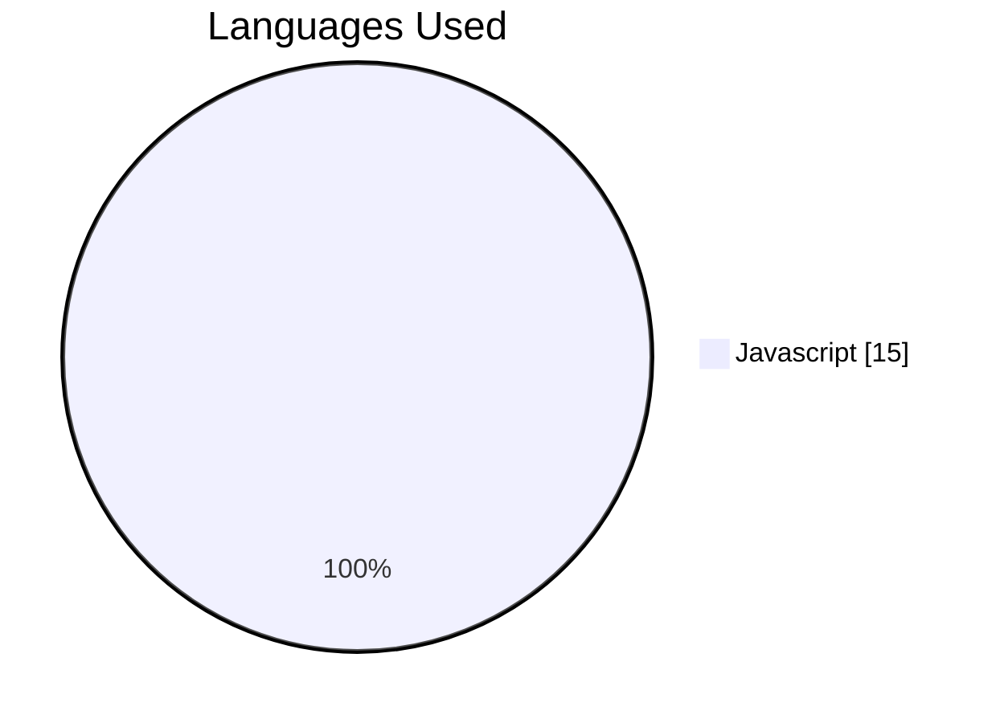
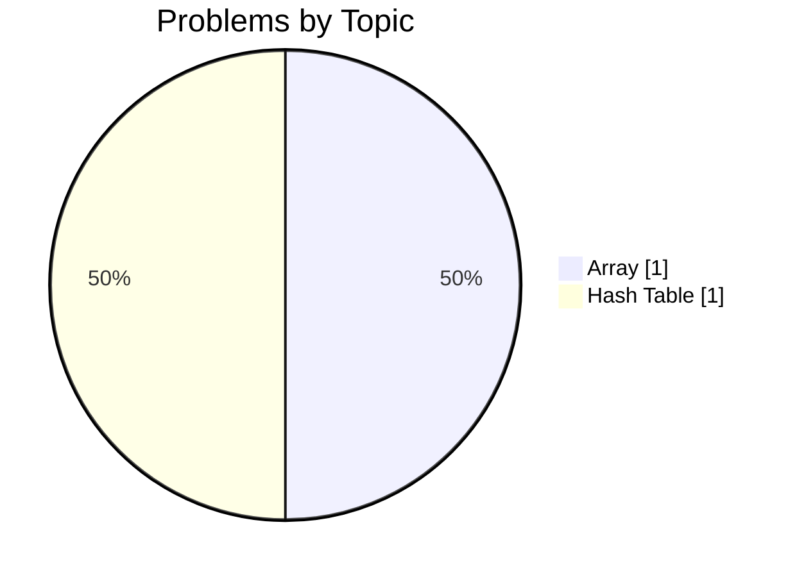
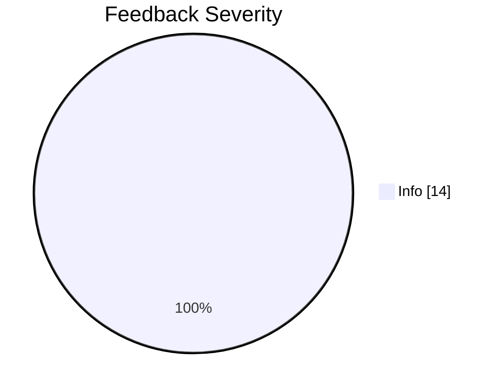
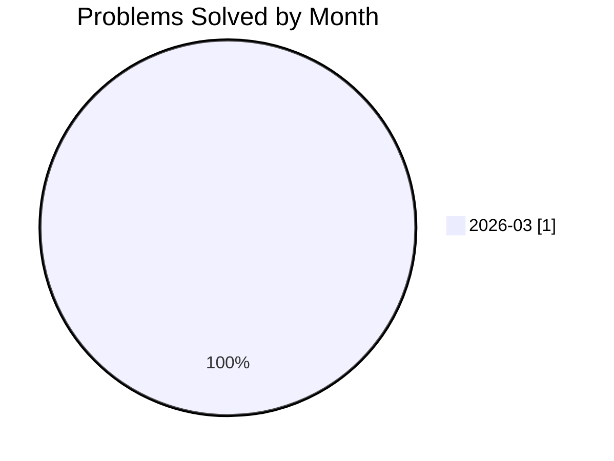

# 🚀 jakubpawinski's Developer Profile

<div align="center">

[](https://github.com/jakubpawinski)
[](https://gitcode.dev/u/jakubpawinski)
[](https://gitcode.dev/u/jakubpawinski)
[](https://gitcode.dev/u/jakubpawinski)

</div>

> **🚀 Emerging JavaScript Problem Solver – 100% Success on First Challenge**

I just cracked my first algorithmic problem using JavaScript, achieving a perfect 100% success rate and sub‑300 ms execution. My focus on array and hash‑table fundamentals paid off, and I’m already building a daily coding habit.

---

## 🧠 AI-Powered Insights

<table>
<tr>
<td width="33%" valign="top">

### ✅ Key Strengths
- 100% success on the problem attempted – flawless execution.
- Strong grasp of array and hash‑table concepts in JavaScript.
- Efficient runtime (average 283 ms) for the solved solution.
- Willingness to iterate – 15 submissions refined the final answer.

</td>
<td width="33%" valign="top">

### 💡 Growth Areas
- Expand beyond Easy difficulty to Medium/Hard challenges.
- Broaden topic coverage beyond arrays and hash tables.
- Increase consistency score by maintaining a longer daily streak.

</td>
<td width="33%" valign="top">

### 🎯 Recommended Focus
- Tackle 1–2 Medium‑difficulty problems each week in new topics.
- Set a goal of coding at least 5 days per week to boost consistency.
- Apply best‑practice guidelines (e.g., naming, modularity) to turn clean‑code suggestions into best‑practice adoption.

</td>
</tr>
</table>

> *"The journey of a thousand miles begins with a single step – keep stepping forward."*

---

## 📊 Problem Solving Statistics

<table>
<tr>
<td width="50%">

### Overall Performance
| Metric | Value |
|:-------|------:|
| 🧩 Problems Attempted | **1** |
| ✅ Problems Solved | **1** |
| 📝 Total Submissions | **15** |
| 🎯 Success Rate | **100%** |
| ⚡ Avg Execution Time | **283.4 ms** |

</td>
<td width="50%">

### Difficulty Breakdown


</td>
</tr>
</table>

---

## 🔥 Activity & Streaks

### Streak Stats

| 🔥 Current Streak | 🏆 Longest Streak | 📅 Last Activity | ✨ Active Today |
|:-----------------:|:-----------------:|:----------------:|:---------------:|
| **2 days** | **2 days** | **2026-03-10** | **✅ Yes** |

### 📅 Weekly Activity Pattern

| Day | Sun | Mon | Tue | Wed | Thu | Fri | Sat |
|:----|:---:|:---:|:---:|:---:|:---:|:---:|:---:|
| **Submissions** | 0 | 14 | 1 | 0 | 0 | 0 | 0 |
| **Success** | 0 | 14 | 1 | 0 | 0 | 0 | 0 |

```text
Weekly Activity Distribution
Sun │░░░░░░░░░░░░░░░░░░░░░░░░░░░░░░│ 0
Mon │██████████████████████████████│ 14
Tue │██░░░░░░░░░░░░░░░░░░░░░░░░░░░░│ 1
Wed │░░░░░░░░░░░░░░░░░░░░░░░░░░░░░░│ 0
Thu │░░░░░░░░░░░░░░░░░░░░░░░░░░░░░░│ 0
Fri │░░░░░░░░░░░░░░░░░░░░░░░░░░░░░░│ 0
Sat │░░░░░░░░░░░░░░░░░░░░░░░░░░░░░░│ 0
```

### 📆 Contribution Heatmap (Last 30 Days)

```text
Contribution Activity (2026-03-09 to 2026-03-10)
2026-03-09 │██│ 14 submissions (1 solved)
2026-03-10 │▒▒│ 1 submissions (1 solved)
```

**Legend:** `░░` No activity | `▒▒` 1-2 submissions | `▓▓` 3-5 submissions | `██` 6+ submissions

---

## 💻 Language Proficiency



| Language | Submissions | Success Rate | Avg Time |
|:---------|------------:|-------------:|---------:|
| Javascript | 15 | 100% | 283.4 ms |

---

## 🎯 Topic Mastery



<details>
<summary>📋 Detailed Topic Statistics</summary>

| Topic | Solved | Attempted | Success Rate | Avg Time |
|:------|-------:|----------:|-------------:|---------:|
| Array | 1 | 1 | 100% | 283.4 ms |
| Hash Table | 1 | 1 | 100% | 283.4 ms |

</details>

---

## 🤖 AI Code Review Insights

<table>
<tr>
<td width="50%">

### Feedback by Type


</td>
<td width="50%">

### Feedback by Severity


| Severity | Count | Percentage |
|:---------|------:|-----------:|
| ℹ️ Info | 14 | 100.0% |
| ⚠️ Warning | 0 | 0.0% |
| 🚨 Critical | 0 | 0.0% |

**Total Reviews:** 14

</td>
</tr>
</table>

### 📈 Code Quality Trend

AI reviews flagged only clean‑code suggestions (100% info), indicating your code is already bug‑free and performant. The next step is to adopt deeper best‑practice patterns to move from "clean" to "exceptional" code.

---

## 📈 Progress Over Time



| Month | Problems Solved | Submissions | Success Rate |
|:------|----------------:|------------:|-------------:|
| 2025-10 | 0 | 0 | 0% |
| 2025-11 | 0 | 0 | 0% |
| 2025-12 | 0 | 0 | 0% |
| 2026-01 | 0 | 0 | 0% |
| 2026-02 | 0 | 0 | 0% |
| 2026-03 | 1 | 15 | 100% |

---

## 🏆 Achievements & Milestones

| Achievement | Description | Progress | Status |
|:------------|:------------|:--------:|:------:|
| **First Blood** 🏆 | Solve your first problem | `1/1` | ✅ Achieved |
| **Getting Started** 🔒 | Solve 10 problems | `1/10` | 🔄 In Progress |
| **Problem Solver** 🔒 | Solve 50 problems | `1/50` | 🔄 In Progress |
| **Century Club** 🔒 | Solve 100 problems | `1/100` | 🔄 In Progress |
| **Hard Mode** 🔒 | Solve 5 hard problems | `0/5` | 🔄 In Progress |
| **Week Warrior** 🔒 | Maintain a 7-day streak | `2/7` | 🔄 In Progress |
| **Monthly Master** 🔒 | Maintain a 30-day streak | `2/30` | 🔄 In Progress |

---

## 📊 Performance Metrics

| ⚡ Avg Execution Time | 🚀 Best Execution Time | 💾 Avg Memory | 🎯 Best Memory |
|:---------------------:|:----------------------:|:-------------:|:--------------:|
| **283.4 ms** | **185 ms** | **N/A MB** | **N/A MB** |

---


## 📉 Computed Metrics

| Metric | Value | Description |
|:-------|:-----:|:------------|
| 🎯 Avg Difficulty Score | **1/3.0** | Average difficulty of solved problems |
| 📈 Consistency Score | **9/100** | Based on activity frequency and streaks |
| 🚀 Growth Rate | **+100%** | Month-over-month improvement |

---

## 💡 Personalized Recommendations

### Next Steps
- **Diversify difficulty**: Pick a Medium problem each week and experiment with different data structures.
- **Increase daily consistency**: Aim for a minimum 5‑day coding streak; use a habit tracker.
- **Elevate code quality**: Review the clean‑code suggestions and integrate style guides (e.g., ESLint) to turn suggestions into best‑practice compliance.
- **Track metrics**: Record execution time and memory usage for each solution to identify optimization opportunities.

---

<div align="center">

### 🌟 Summary

Congrats on your first milestone! A perfect success rate, fast execution, and solid fundamentals set a strong foundation. With a bit more variety and consistency, you’re well on your way to becoming a versatile JavaScript algorithmist.

---

**Generated by [GitCode.dev](https://gitcode.dev)** | Last updated: 2026-03-10 11:08:20 UTC

<sub>
🔥 Current Streak: 2 days |
✅ Problems Solved: 1 |
🎯 Success Rate: 100%
</sub>

</div>